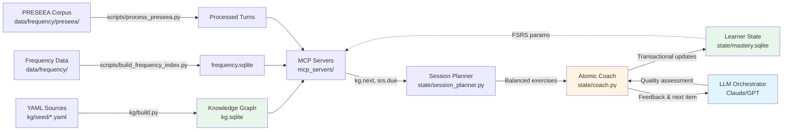

# Spanish Learning Project

**A personal exploration of LLM-orchestrated language learning with Knowledge Graphs and Spaced Repetition.**

This project tests whether **KG + SRS + LLM** can create effective language instruction. It implements a hybrid architecture where an LLM serves as conversational coach while code handles all data integrity through atomic, transactional operations.

---

## What This Is

A Spanish language coach system that combines:
- **Knowledge Graph (KG)**: Tracks linguistic items, prerequisites, and learner progress
- **Spaced Repetition (FSRS)**: Optimizes review scheduling for retention
- **LLM Orchestrator**: Conducts conversational lessons using atomic tools
- **Four Strands Framework**: Balances meaning-focused input/output (comprehension & communication), language-focused learning (explicit study), and fluency development (automaticity with mastered content)

The key insight: **LLMs excel at pedagogy but struggle with complex database protocols.** This project provides atomic operations that wrap multi-table updates, ensuring 95%+ data consistency while preserving conversational flexibility.

**Pedagogical Model**: Progressive strand balancing with defeasible recommendations. System selects exercises to maintain ~25% coverage across input/output/learning/fluency strands, informed by frequency data, CEFR alignment, and learner mastery. Difficulty calibration uses Zipf scores from multiple corpora. LLM assesses quality using CEFR-aligned rubrics, while code handles all scheduling and mastery progression.

### Hybrid Architecture

```
LLM Responsibilities (Pedagogical):
  - Conduct conversational lessons
  - Assess quality (0-5 scale)
  - Provide feedback and corrections
  - Adapt pacing to learner needs

Code Responsibilities (Data Integrity):
  - All database writes
  - FSRS calculations and scheduling
  - Mastery status progression
  - Four Strands balance tracking

Atomic Tools Bridge the Gap:
  coach.preview_session()  → preview plan WITHOUT starting (allows negotiation)
  coach.adjust_focus()     → translate goals into preference weights
  coach.start_session()    → session plan with exercises
  coach.record_exercise()  → transactional FSRS + logging
  coach.end_session()      → session summary
```

---

## Current Status

**Phase 3 Complete** (2025-11-05)

✅ **Working Infrastructure**:
- Knowledge Graph build system (YAML → SQLite)
- Full FSRS algorithm implementation
- Three MCP servers (KG, SRS, Speech)
- Session Planner with Four Strands balancing (Nation framework)
- Atomic Coaching Tools with learner agency (preview/negotiate)
- 65+ tests with comprehensive fixtures
- Migration system with automatic backups

✅ **Content (100 B1 nodes)**:
- 20 CanDo descriptors (CEFR-aligned)
- 15 Constructions (subjunctive, conditionals, connectors)
- 24 Lexemes (high-frequency vocabulary with Zipf scores)
- 10 Morphology nodes (pronoun stacking, se impersonal, etc.)
- 8 Functions (travel, work, health, negotiations)
- 8 Topics (work, leisure, travel, health, urban living)
- 6 Discourse moves (turn-taking, reformulation, hedging)
- 5 Pragmatic cues (register, softening, disagreement)
- 4 Assessment criteria (B1 evaluation rubrics)

✅ **Learner Agency Features**:
- Preview session plans before starting
- Negotiate adjustments based on goals
- Goal → preference weight translation
- Maintains algorithmic constraints (SRS, strand balance)

🚧 **Next**:
- End-to-end LLM coaching sessions
- Measurement and tuning
- Real learner validation

---

## Quick Start

### For Learners: Start Your First Lesson

```bash
# Launch your first Spanish lesson
./LLanguageMe
```

This interactive launcher will:
1. Guide you through 2-minute onboarding (first time only)
2. Set up your learner profile and progress tracking
3. Generate personalized session context for your LLM
4. Prepare you to begin practicing Spanish

After setup, launch your LLM (Claude, ChatGPT, etc.) and paste the generated context to begin your personalized lesson.

#### Launch Notes (Cross-Platform)

**Python 3.11 Required**: This project is tested on Python 3.11; other versions are untested.

If `./LLanguageMe` fails:
- **macOS/Linux**: Ensure it's executable: `chmod +x ./LLanguageMe`
- **Windows (Git Bash/WSL)**: Run with: `bash ./LLanguageMe`
- **Alternative**: Run directly with Python: `python ./LLanguageMe` or `python3 ./LLanguageMe`

**Sanity check** after install:
```bash
python -c "import mcp_servers; print('OK')"
```

#### Troubleshooting

**"ModuleNotFoundError: No module named 'yaml'"**
```bash
pip install -r requirements.txt
```

**"Empty database" or "No items found"**
```bash
# Build knowledge graph
python kg/build.py kg/seed kg.sqlite

# Initialize mastery database
python state/db_init.py

# Bootstrap practice items
python agents/bootstrap_items.py
```

**"Migrations not applied"**
```bash
python state/migrations/migrate.py
```

**SQLite headers missing (Linux)**
```bash
# Ubuntu/Debian
sudo apt-get install libsqlite3-dev

# Fedora/RHEL
sudo dnf install sqlite-devel
```

### For Developers: Three Commands to First Result

```bash
# 1. Setup environment and dependencies (Linux/macOS)
python3.11 -m venv .venv && source .venv/bin/activate && pip install -e .

# 2. Build knowledge graph from YAML sources
python kg/build.py kg/seed kg.sqlite

# 3. Run smoke test to verify everything works
python -m mcp_servers.kg_server --test --kg-db ./kg.sqlite
# Expected: Shows KG server capabilities with real data
```

**What you get**: A working knowledge graph server, session planner, and atomic coaching tools ready for LLM integration.

### Quick Commands (Makefile)

All build and test operations are available via Makefile:

```bash
make help           # Show all available commands
make build-db       # Build all databases (KG + frequency)
make build-kg       # Build knowledge graph only
make test           # Run all tests
make test-coach     # Test atomic coaching tools
make test-quick     # Quick feedback (stop on first failure)
make kg-server      # Run KG server in test mode
make srs-server     # Run SRS server in test mode
```

### Testing Learner Agency

Test the preview/negotiate workflow that gives learners control over session planning:

```bash
# Initialize databases
python state/db_init.py
python agents/bootstrap_items.py

# Run interactive demo
python test_preview_negotiate.py
```

This demonstrates:
- Previewing session plans before committing
- Adjusting focus based on learner goals ("prepare for travel", "improve grammar", etc.)
- Starting sessions with negotiated preferences
- Maintaining algorithmic constraints (SRS schedules, strand balance)

See `COACH_INSTRUCTIONS.md` for complete workflow documentation.

### Build Knowledge Graph

```bash
# Compile YAML nodes into SQLite
python kg/build.py kg/seed kg.sqlite

# Verify KG structure
python scripts/validate_kg.py
```

### Test Atomic Tools

```bash
# Run atomic coaching tools test suite
python state/test_coach.py

# Test session planner
python state/test_session_planner.py

# Run all tests
pytest
```

### Run MCP Servers

```bash
# Test mode (demonstrates all tools)
python -m mcp_servers.kg_server --test
python -m mcp_servers.srs_server --test
python -m mcp_servers.speech_server --test

# Interactive mode
python -m mcp_servers.kg_server --interactive
```

---

## Usage Example

```python
from state.coach import Coach

# Initialize coach
coach = Coach()

# Start session
session = coach.start_session(
    learner_id="brett",
    duration_minutes=20
)

# Record exercise (LLM provides quality assessment)
result = coach.record_exercise(
    session_id=session['session_id'],
    item_id="card.es.ser_vs_estar.001",
    quality=4,  # LLM's pedagogical judgment
    learner_response="Era un día soleado",
    duration_seconds=45,
    strand="meaning_output"
)

# Coach handles:
# ✓ FSRS parameter updates (stability, difficulty)
# ✓ Mastery status progression
# ✓ Logging to 4+ tables (transactional)
# ✓ Strand balance tracking
# ✓ Comprehensive feedback for next decision

print(result.feedback_for_llm)
# "Strong performance! | Stability: 4.1 days | Status: learning"

# End session
summary = coach.end_session(session['session_id'])
```

---

## Architecture

### System Diagram



**Data Flow**:
1. **Build**: `kg/build.py` compiles YAML → SQLite; frequency scripts normalize corpus data
2. **Query**: MCP servers expose KG queries, SRS scheduling, and speech processing
3. **Plan**: Session Planner balances Four Strands using KG frontier and SRS due items
4. **Teach**: LLM orchestrator conducts lessons, assesses quality (0-5)
5. **Update**: Atomic Coach wraps multi-table FSRS updates transactionally
6. **Loop**: Updated mastery feeds back into scheduling

### Core Components

- **Knowledge Graph** (`kg/`): YAML-defined linguistic nodes with prerequisites, CEFR levels, practice prompts
- **Learner State** (`state/`): Per-learner mastery tracking with FSRS parameters
- **Session Planner** (`state/session_planner.py`): Four Strands balancing with progressive pressure
- **Atomic Tools** (`state/coach.py`): High-level wrapper for LLM with transactional operations
- **MCP Servers** (`mcp_servers/`): Tool servers exposing KG queries, SRS scheduling, speech processing
- **Frequency Data** (`data/frequency/`): Normalized corpus frequencies and PRESEEA transcripts

### Four Strands Framework

Based on Paul Nation's research:
- **Meaning-focused Input** (25%): Comprehension activities
- **Meaning-focused Output** (25%): Communication activities
- **Language-focused Learning** (25%): Explicit study and drills
- **Fluency Development** (25%): Automaticity with mastered content

Progressive pressure algorithm maintains balance with ±5% tolerance, escalating weights when imbalanced.

---

## Documentation

**For Claude Code / AI Agents**:
- [`CLAUDE.md`](CLAUDE.md) - Development guide, commands, conventions
- [`STRATEGY.md`](STRATEGY.md) - Strategic thinking, constraints, LLM reliability assessment
- [`FOUR_STRANDS_REDESIGN.md`](FOUR_STRANDS_REDESIGN.md) - Complete Four Strands redesign document

**Implementation Details**:
- [`state/SESSION_PLANNER.md`](state/SESSION_PLANNER.md) - Session planner API and usage
- [`state/README.md`](state/README.md) - SRS database schema and FSRS algorithm
- [`kg/README.md`](kg/README.md) - Knowledge graph build system
- [`data/frequency/README.md`](data/frequency/README.md) - Frequency data sources

**Status & History**:
- [`STATUS.md`](STATUS.md) - Implementation timeline
- [`IMPLEMENTATION_SUMMARY.md`](IMPLEMENTATION_SUMMARY.md) - Detailed build summary

---

## Data Sources & Reproducibility

All corpus data, frequency lists, and databases are **reproducible from source** and not tracked in git. See [`DATA_SOURCES.md`](DATA_SOURCES.md) for:
- Data provenance and licenses
- Download instructions
- Build commands

**Artifact Policy**: Only source code and small test fixtures (<1MB) are version controlled. Generated databases (kg.sqlite, frequency.sqlite) and downloaded corpora must be rebuilt locally via:
```bash
python kg/build.py kg/seed kg.sqlite
python scripts/build_frequency_index.py
python scripts/process_preseea.py data/frequency/preseea data/frequency/preseea/processed
```

---

## Evaluation & Metrics

This project will measure effectiveness through:

**Coverage Metrics** (Knowledge Graph):
- % of CEFR A1-B1 constructs represented
- % of top-5000 frequency vocabulary included
- Prerequisite chain completeness

**Scheduling Metrics** (FSRS):
- Stability progression over time
- Mastery transition rates (NEW → LEARNING → MASTERED)
- Review distribution across strands

**Balance Metrics** (Four Strands):
- Time distribution across strands (target: 25±5% each)
- Deviation from target over sessions
- Fluency queue utilization rate

**System Metrics** (LLM Integration):
- Database consistency rate (target: >95%)
- Tool call success rate (target: >85%)
- Session completion rate

**Future**: Compare learner self-assessment against CEFR can-do descriptors at milestones.

---

## Development

### Testing

```bash
# Run all tests
pytest

# By marker
pytest -m unit
pytest -m integration
pytest -m "kg and not slow"

# Quick feedback (stop on first failure)
pytest --maxfail=1 --disable-warnings --no-cov

# With coverage
pytest --cov --cov-report=html
# View at htmlcov/index.html
```

### Database Operations

```bash
# Inspect KG
python -c "import sqlite3; conn = sqlite3.connect('kg.sqlite');
cursor = conn.cursor();
cursor.execute('SELECT node_id, type, label FROM nodes LIMIT 5');
print(cursor.fetchall())"

# Check migration status
python state/migrations/migrate.py --status

# Apply migration (with backup)
python state/migrations/migrate.py --apply 001_four_strands

# Frequency lookup
python tools/frequency_lookup.py hablar

# Sample PRESEEA corpus
python tools/preseea_sampler.py --city MEXI --age H11 --limit 5
```

### Linting

```bash
ruff check .
ruff format .
```

---

## Design Philosophy

**"What Would Nation Do?"**

1. **Balance over perfection**: ~25% per strand matters more than exact precision
2. **Learner autonomy**: System suggests, learner decides (defeasible recommendations)
3. **Practical simplicity**: Stopwatch beats complex measurement systems
4. **Large quantities**: Amount of practice >> precision of assessment
5. **Learner perception is valid**: Subjective "getting faster" is meaningful data

**Hybrid LLM Architecture**:
- LLMs are ~85-90% reliable at calling tools
- LLMs are ~60-70% reliable at complex multi-step database protocols
- Solution: Atomic tools ensure 95%+ consistency while preserving conversational flexibility
- Nation-grade tracking with LLM-grade pedagogy

---

## Project Context

### Purpose
- **Primary**: Personal exploration testing AI tooling capabilities
- **Secondary**: Test bed for ideas (future English EAP application)
- **Nature**: Hobby/research project with no hard deadlines

### Constraints
- Currently: Brett (solo user, self-directed Spanish learning)
- Future: Potentially Humber College EAP students (English, MS Copilot-based)
- Cost: Leverage existing licenses, avoid marginal costs

### Strategic Questions Being Explored
1. Can LLM orchestrators follow complex pedagogical rules consistently?
2. Does MCP architecture work for stateful, multi-turn tutoring?
3. Where does AI excel vs. where you need deterministic code?
4. How much of this transfers from Spanish to English EAP?

---

## Technology Stack

- **Python 3.11+**: Core implementation
- **SQLite**: Knowledge graph and mastery databases
- **YAML**: Knowledge graph source format
- **FSRS Algorithm**: Modern spaced repetition scheduler
- **MCP (Model Context Protocol)**: Tool servers for LLM integration
- **pytest**: Testing framework (65+ tests)

---

## Contributing

This is a personal exploration project. Feel free to:
- Explore the codebase
- Run tests and experiments
- Learn from the architecture
- Fork for your own language learning experiments

Not accepting external contributions at this time, but issues and questions are welcome!

---

## License

MIT License - See LICENSE file

---

## Acknowledgments

- **Paul Nation**: Four Strands framework and language learning methodology
- **FSRS Algorithm**: Modern alternative to SM-2 for spaced repetition
- **Anthropic**: Claude Code for rapid LLM-assisted development
- **PRESEEA Corpus**: Authentic Spanish oral transcripts with demographics

---

**Status**: Phase 2.5 complete (Atomic Coaching Tools implemented and tested)
**Next**: LLM integration and measurement
**Last Updated**: 2025-11-05
